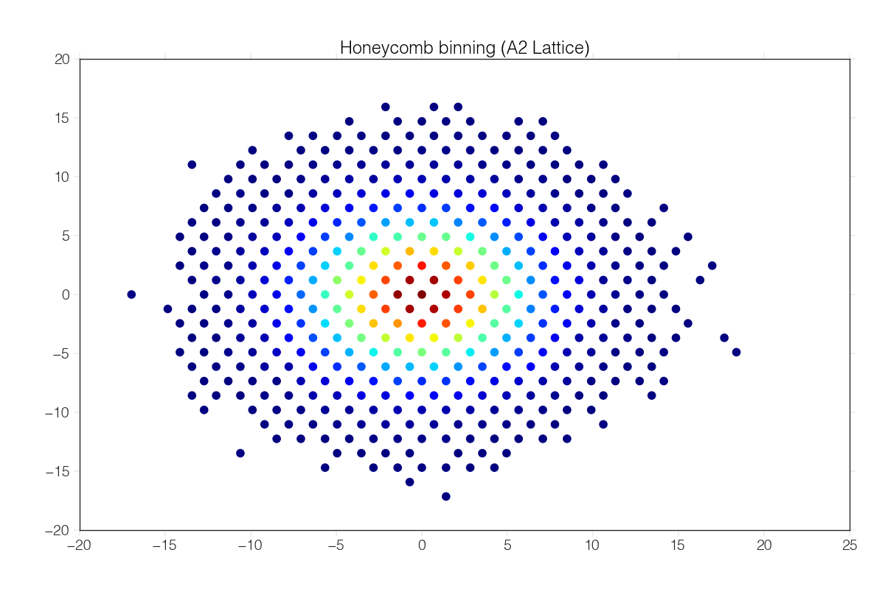

******************
A2 Lattice Example 
******************

This simple binning routine shows how latbin is used to bin data onto a
lattice

.. code:: python

    import latbin
    import numpy as np
    
    # create some fake data with shape (npts,ndim)
    npts,ndim = 60000,2
    data = np.random.normal(size=(npts, ndim))*4.0

Latbin contains several classes of lattices. This one is an :math:`A^n` lattice.
The :math:`A^2` case is a familiar hexagonal or honeycomb lattice.

.. code:: python

    # create an A2 lattice (honeycomb binning)
    a2 = latbin.ALattice(2)

The lattices can be used to histogram the fake data. What's returned and
here stored in *h* is a `latbin.PointInformation` object. This
object is indexed by the unique lattice point representations. The
values are the histogramed data; in this case, the density of data
around a particular lattice point.

.. code:: python

    # histogram the data onto A2 Lattice
    h = a2.histogram(data)
    
    # get the lattice points in the data space
    centers = h.centers()

We can then plot the result using matplotlib

.. code:: python

    # show the result
    import matplotlib.pylab as plt
    plt.title("Honeycomb binning (A2 Lattice)")
    plt.scatter(centers[:,0],centers[:,1],c=h.values(), s=70)
    plt.show()

.. COULD do the documentation like this:
.. .. literalinclude:: a2_lattice.py
..    :linenos:
..    :language: python

:download:`(source) <a2_lattice.py>`
